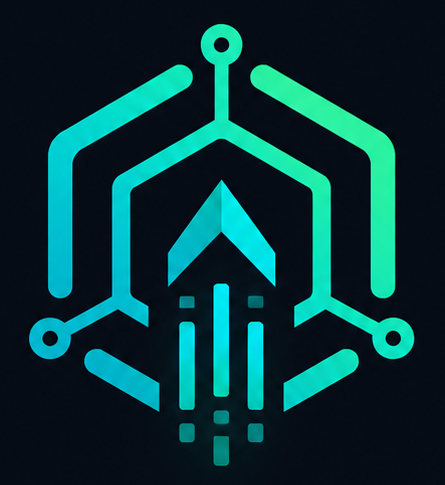

<div align="center">



# Codex Launcher

**Point [Codex](https://github.com/openai/codex) at any OpenAI-compatible API and manage providers, models, and launch settings from one desktop app.**

[](https://github.com/CarapaceUDE/codex-launchpad/actions/workflows/ci.yml)
[](LICENSE)
[](https://carapaceai.org/patreon)
[](https://rustup.rs/)
[](web/)
[]()

[**Website**](https://carapaceai.org) · [**Patreon — official builds**](https://carapaceai.org/patreon) · [**Discord**](https://carapaceai.org/discord) · [**Issues**](https://github.com/CarapaceUDE/codex-launchpad/issues)

<br />


<sub>Switch between Codex cloud sign-in and any OpenAI-compatible <code>/v1</code> endpoint, pick a model, and launch.</sub>

</div>

## Features

- **Dual provider modes** — Codex cloud account or route through any OpenAI-compatible API (vLLM, LiteLLM, OpenRouter, your own gateway, etc.)
- **Model discovery** — fetch and cache models from your endpoint's API
- **Codex config sync** — writes and restores `~/.codex/config.toml` safely
- **Desktop GUI + CLI** — full UI or scriptable headless workflows
- **Cross-platform** — Windows, macOS, and Linux builds
- **Dark / light theme**

## Contents

- [Distribution](#distribution)
- [Quick Start](#quick-start-gui)
- [CLI usage](#cli-usage-headless--automation)
- [Config](#config)
- [Build system](#build-system)
- [Testing](#testing)
- [Security](#security)
- [License](#license)

---

## Distribution

| What | License / terms | How to get it |
| ---- | --------------- | ------------- |
| **Source code** | [MIT License](LICENSE) — free for everyone | This repository |
| **Official binaries** | [Official build terms](OFFICIAL_BUILDS.md) — personal use, no redistribution | [Patreon supporters](https://carapaceai.org/patreon) |
| **Self-built binary** | MIT (you compiled from source) | [Build instructions](#quick-start-gui) below |

**Why Patreon for official builds?** Carapace is early-stage and needs supporter revenue to keep building. The source is fully open under MIT, so anyone can compile and run the app for free. Official pre-built binaries are a convenience for [Patreon supporters](https://carapaceai.org/patreon) while we grow.

During this phase, that split is intentional. Building from source naturally filters for people comfortable debugging setup — the kind of early users who file useful issues and contribute fixes. We'd rather work with that crowd while things are still rough than field a wave of "it just broke" reports from folks who expected a polished download-and-go experience. Once the project is sustainable, publishing builds on [GitHub Releases](https://github.com/CarapaceUDE/codex-launchpad/releases) becomes a priority — but not yet.

---

## Prerequisites

- **Rust / Cargo** � `rustc` 1.75+ (install via [rustup](https://rustup.rs/))
- **Node.js** 18+ (for the web UI)
- **Windows 10+** (tested on Windows; other platforms may work for the CLI)
- **Codex CLI or Desktop App** � installed and discoverable on PATH (or set `codexCommand` in config)
- An **OpenAI-compatible API** reachable from your machine (local server, LAN host, or remote gateway)

## Quick Start (GUI)

**Official builds:** download the latest binary from [Patreon](https://carapaceai.org/patreon).

**From source:** build and run locally:

1. **Copy and edit the config:**
   ```powershell
   Copy-Item config.example.json config.json
   # Edit config.json with your API host, port, and key
   notepad config.json
   ```

2. **Run the launcher:**
   ```powershell
   .\run-gui.cmd
   ```

   This script runs a build check first (Rust + web UI) and launches `target\release\codex-launchpad.exe --gui`.

3. **Use the UI:**
   - **Launch tab** � select a model, launch Codex.
   - **Models tab** � discover, cache, and select models from your API.
   - **Settings tab** � configure provider, API key mode, Codex command path, etc.
   - **Logs tab** � view real-time launcher logs.
   - **About tab** � version and help info.

## CLI Usage (headless / automation)

You can also operate the launcher entirely from the command line.

### Building & Running

```powershell
# Build everything (Rust + web UI)
.\build.cmd

# Or the release binary directly
cargo build --release

# Run the CLI
.\scripts\run-cli.ps1 --config config.json
```

The CLI binary is `target\debug\codex-launchpad.exe` (debug) or `target\release\codex-launchpad.exe` (release).

### Refreshing Models

```powershell
# Discover and cache models from your configured API
.\scripts\refresh-models.ps1

# Or with a specific config
.\scripts\run-cli.ps1 --config config.json --refresh-models
```

### Launching Codex from CLI

```powershell
.\launch-codex.cmd
# or
.\scripts\launch-codex.ps1
```

These scripts read `config.json`, set `OPENAI_BASE_URL` and `OPENAI_API_KEY` environment variables, then launch Codex. They auto-detect the Codex executable (including Microsoft Store packaged apps).

### Restoring Previous Config

The launcher backs up the previous Codex root model/provider before applying its own. Restore it via:

```powershell
.\scripts\restore.ps1
```

## Config

Local settings live in `config.json` (gitignored). Public defaults are in `config.example.json`.

| Field | Type | Description |
|---|---|---|
| `ollamaIp` | string | Hostname or IP of the OpenAI-compatible API server |
| `ollamaPort` | int | API port (default `11434`; use whatever your server exposes) |
| `ollamaScheme` | string | `http` or `https` (default `http`) |
| `apiKey` | string | API key for the endpoint, if required |
| `persistCodexConfig` | bool | Write a provider into `~/.codex/config.toml` (default `true`) |
| `discoverOllamaModels` | bool | Auto-fetch models from `/v1/models` on startup (default `true`) |
| `codexModel` | string | Override Codex model; leave empty to use UI selection |
| `codexProviderId` | string | Provider identifier written to Codex config |
| `codexProviderName` | string | Display name for the provider |
| `codexApiKeyMode` | string | `experimentalBearerToken` / `envKey` / `none` (see below) |
| `codexConfigPath` | string | Override default `~/.codex/config.toml` path |
| `codexCommand` | string | Full path to Codex executable; leave empty to auto-detect |
| `codexArgs` | array | Extra arguments passed to Codex |
| `workingDirectory` | string | Working directory for launched Codex processes |

### `codexApiKeyMode` Options

- **`experimentalBearerToken`** � Writes the configured `apiKey` directly into the Codex provider config.
- **`envKey`** � Sets `env_key = "OPENAI_API_KEY"` so Codex reads from the environment variable instead.
- **`none`** � Writes no auth key; the endpoint must allow unauthenticated requests.

## Build System

### `build.cmd` � Full Build

Runs a conditional build script (`scripts\build.ps1`) that invokes `cargo build --bins`. This compiles the Rust binaries (GUI and CLI).

### `build-check.ps1` � Smart Build Check

Used by `run-gui.cmd`. Checks whether the release binary or web UI bundle is stale and rebuilds only what's needed:
- Compares source file timestamps against the existing binary and web bundle.
- Builds Rust if any `.rs` source is newer than `target\release\codex-launchpad.exe`.
- Runs `npm run build` in `web/` if any web source is newer than `web\dist\assets\index.js`.
- Stages the web build output and `config.json` next to the release binary.

### `run-gui.cmd` � Launch GUI

1. Runs `build-check.ps1` to ensure everything is built.
2. Launches `target\release\codex-launchpad.exe --gui`.

### `build.rs` � Cargo Build Script

Runs `npm run build` automatically during `cargo build` if `web/dist/index.html` is missing. Ensures the web UI is always present alongside the binary.

## Testing

The **CI** badge runs [GitHub Actions](https://github.com/CarapaceUDE/codex-launchpad/actions/workflows/ci.yml) on every push to `master`: it checks Rust formatting, runs Clippy lints, and executes unit tests. It does not build release binaries (those are distributed via [Patreon](https://carapaceai.org/patreon) for now).

```powershell
# Format check, unit tests, and clippy
.\test.cmd
```

This runs the same checks locally:
```powershell
cargo fmt -- --check
cargo test
cargo clippy --all-targets -- -D warnings
```

## Diagnostics

```powershell
# Health-check diagnostic script
.\diagnose.ps1
```

Tests launcher RPC, API connectivity, and model list discovery. Helpful for troubleshooting endpoint issues.

## Security

> **API keys are stored in plaintext** in `config.json` and `~/.codex/config.toml`. Restrict file permissions on multi-user systems. Consider using `envKey` mode or an external secret manager for sensitive deployments.

To report a security vulnerability, see [SECURITY.md](SECURITY.md). Please do not file public GitHub issues for security reports.

## License

Source code is licensed under the [MIT License](LICENSE). Copyright (c) 2026 Carapace LLC.

Official pre-built binaries are distributed separately under the [Official Build terms](OFFICIAL_BUILDS.md).

## Trademark

This project is an independent tool and is not affiliated with, endorsed by, or sponsored by OpenAI. Codex is a trademark of OpenAI.

## Project Structure

```
+-- src/                  # Rust source (GUI + CLI binaries)
�   +-- main.rs           # CLI entry point
�   +-- web_backend.rs    # HTTP server + UI serving
+-- web/                  # Vite + React + Tailwind web UI
�   +-- src/              # React components & pages
�   +-- dist/             # Built output (gitignored)
�   +-- package.json      # Frontend deps
+-- scripts/              # PowerShell scripts
�   +-- lib.ps1           # Shared helpers (Get-CargoCommand)
�   +-- run-gui.ps1       # GUI run script
�   +-- run-cli.ps1       # CLI run script
�   +-- refresh-models.ps1
�   +-- restore.ps1
�   +-- build.ps1
+-- build-check.ps1       # Smart build checker (used by run-gui.cmd)
+-- build.rs              # Cargo build script (auto-builds web UI)
+-- launch-codex.ps1      # Standalone Codex launcher
+-- diagnose.ps1          # Health check diagnostic
+-- config.example.json   # Public config template
+-- config.json           # Local config (gitignored)
+-- run-gui.cmd           # Windows launcher for the GUI
+-- build.cmd             # Windows launcher for cargo build
+-- test.cmd              # Windows launcher for cargo test
+-- docs/
    +-- architecture.md   # Architecture notes
```

## Resources

- [Architecture docs](docs/architecture.md)
- [Contributing guide](CONTRIBUTING.md)
- [Code of Conduct](CODE_OF_CONDUCT.md)
- [Security policy](SECURITY.md)
- [License](LICENSE)
- [Official build terms](OFFICIAL_BUILDS.md)
- [Release process](docs/release-process.md)