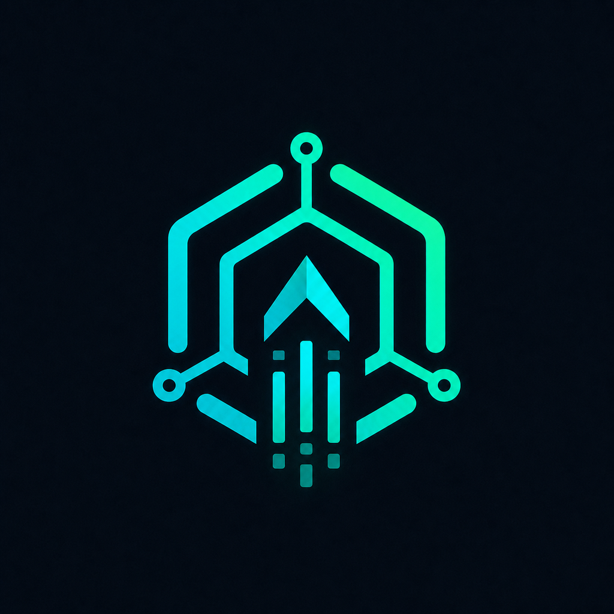
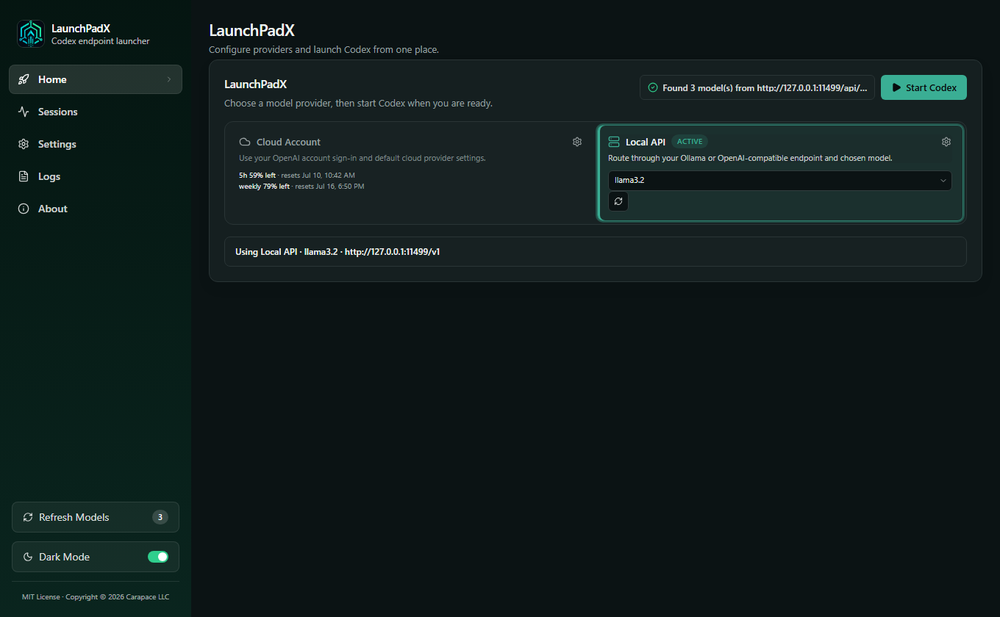

<div align="center">



# LaunchPadX

**Point [Codex](https://github.com/openai/codex) at any OpenAI-compatible API and manage providers, models, and launch settings from one desktop app.**

[](https://github.com/CarapaceUDE/launchpadx/actions/workflows/ci.yml)
[](LICENSE)
[](https://github.com/CarapaceUDE/launchpadx/releases/latest)
[](https://rustup.rs/)
[](web/)
[]()

[**Website**](https://carapaceai.org) · [**Downloads**](https://github.com/CarapaceUDE/launchpadx/releases) · [**Discord**](https://carapaceai.org/discord) · [**Issues**](https://github.com/CarapaceUDE/launchpadx/issues)

<br />



<sub>Switch between Codex cloud sign-in and any OpenAI-compatible <code>/v1</code> endpoint, pick a model, and launch.</sub>

</div>

> [!WARNING]
> **LaunchPadX is an early release and has not yet been thoroughly tested across every system and endpoint.** Expect rough edges, bugs, or issues we have not caught. Please report problems through [GitHub Issues](https://github.com/CarapaceUDE/launchpadx/issues/new/choose) with concise reproduction steps, your OS and LaunchPadX version, expected versus actual behavior, and relevant logs with secrets removed.

## Quick Start

1. **[Download the latest release](https://github.com/CarapaceUDE/launchpadx/releases/latest)** for Windows, macOS, or Linux.
2. Extract the archive and run `launchpadx` (`launchpadx.exe` on Windows).
3. Open **Settings**, enter your OpenAI-compatible endpoint and API-key settings, choose a model, then launch Codex from **Home**.

Found a bug? [Open a bug report](https://github.com/CarapaceUDE/launchpadx/issues/new?template=bug_report.md) and include the shortest reliable steps needed to reproduce it.

## Join the Community

**[Join the CarapaceAI Discord →](https://carapaceai.org/discord)**

Meet other LaunchPadX users, share compatible endpoints and setups, ask questions, and follow project updates. For reproducible bugs and feature requests, please continue to use [GitHub Issues](https://github.com/CarapaceUDE/launchpadx/issues) so details remain searchable and actionable.

## Features

- **Dual provider modes** — Codex cloud account or route through any OpenAI-compatible API (vLLM, LiteLLM, OpenRouter, your own gateway, etc.)
- **Model discovery** — fetch and cache models from your endpoint's API
- **Codex config sync** — writes and restores `~/.codex/config.toml` safely
- **Desktop GUI + CLI** — full UI or scriptable headless workflows
- **Cross-platform** — Windows, macOS, and Linux builds
- **Dark / light theme**

## Contents

- [Distribution](#distribution)
- [Quick Start](#quick-start)
- [Join the community](#join-the-community)
- [Build from source](#build-from-source-gui)
- [CLI usage](#cli-usage-headless--automation)
- [Config](#config)
- [Build system](#build-system)
- [Testing](#testing)
- [Security](#security)
- [License](#license)

---

## Distribution

| What | License / terms | How to get it |
| ---- | --------------- | ------------- |
| **Source code** | [MIT License](LICENSE) | This repository |
| **Release binaries** | [MIT License](LICENSE) | [GitHub Releases](https://github.com/CarapaceUDE/launchpadx/releases) |
| **Self-built binary** | [MIT License](LICENSE) | [Build instructions](#build-from-source-gui) below |

Release binaries are built from the tagged commit by GitHub Actions on Windows, macOS, and Linux. This makes the build inputs and logs visible alongside the source. Community support is available on our [Discord server](https://carapaceai.org/discord).

---

## Prerequisites

- **Rust / Cargo** — `rustc` 1.75+ (install via [rustup](https://rustup.rs/))
- **Node.js** 18+ and **npm** (for the web UI — run `cd web && npm ci` once after cloning; `build.rs` installs web dependencies automatically when `web/node_modules` is missing on any OS)
- **Codex CLI or Desktop App** — installed and discoverable on PATH (or set `codexCommand` in config)
- An **OpenAI-compatible API** reachable from your machine (local server, LAN host, or remote gateway)

**GUI builds** also need native webview dependencies (wry/tao):

| Platform | Packages / tools |
| -------- | ---------------- |
| **Linux** | GTK 3 + WebKitGTK — e.g. on Debian/Ubuntu: `sudo apt install libgtk-3-dev libwebkit2gtk-4.1-dev libappindicator3-dev librsvg2-dev pkg-config` |
| **macOS** | Xcode Command Line Tools (`xcode-select --install`) |
| **Windows** | WebView2 (usually preinstalled on Windows 10/11) |

The project targets **Windows, macOS, and Linux**. You can build on any of them for the host OS. Cross-compiling for another OS is supported via `rustup target add` + `cargo build --target <triple>` (see [Build system](#build-system)).

## Build from Source (GUI)

Build and run locally on any supported OS:

1. **Copy and edit the config:**
   ```sh
   cp config.example.json config.json
   # Edit config.json with your API host, port, and key
   ```

2. **Build and launch the GUI:**
   ```sh
   cd web && npm ci && npm run build && cd ..
   cargo build --release
   ./target/release/launchpadx --gui
   ```

   On Windows the binary is `target\release\launchpadx.exe`. If `web/dist/` is missing, `cargo build` runs `npm ci` (when `web/node_modules` is absent) and then `npm run build` via `build.rs`. You can still run `cd web && npm ci` yourself first — that is the most reliable path on a fresh clone.

   **Windows shortcut:** `.\run-gui.cmd` runs a stale-build check and launches the release GUI — convenience only, not required.

3. **Use the UI:**
   - **Launch tab** — select a model, launch Codex.
   - **Models tab** — discover, cache, and select models from your API.
   - **Settings tab** — configure provider, API key mode, Codex command path, etc.
   - **Logs tab** — view real-time launchpad logs.
   - **About tab** — version and help info.

## CLI Usage (headless / automation)

You can also operate the launchpad entirely from the command line on any platform.

### Building & Running

```sh
# Build everything (Rust + web UI)
cd web && npm ci && npm run build && cd ..
cargo build --release

# Run the CLI (same binary as the GUI)
./target/release/launchpadx --config config.json
```

The binary lives at `target/debug/launchpadx` (debug) or `target/release/launchpadx` (release). Add `.exe` on Windows.

### Common CLI commands

```sh
launchpadx --refresh-models          # discover and cache models
launchpadx --list-models             # print cached models
launchpadx --write-config-only       # write ~/.codex/config.toml only
launchpadx --launch                  # apply config and launch Codex
launchpadx --restore                 # restore previous Codex settings
launchpadx --diagnose                # setup and connectivity checks
launchpadx --help                    # full flag list
```

Pass `--config path/to/config.json` when not running from the repo root.

### Windows helper scripts (optional)

PowerShell wrappers in `scripts/` mirror the CLI flags above (`run-cli.ps1`, `refresh-models.ps1`, `restore.ps1`, `launch-codex.ps1`). They are **Windows-only conveniences** — the `launchpadx` binary is the portable interface.

## Config

Local settings live in `config.json` (gitignored). Public defaults are in `config.example.json`.

| Field | Type | Description |
|---|---|---|
| `ollamaIp` | string | Hostname or IP of the OpenAI-compatible API server |
| `ollamaPort` | int | API port (default `11434`; use whatever your server exposes) |
| `ollamaScheme` | string | `http` or `https` (default `http`) |
| `apiKey` | string | API key for the endpoint, if required |
| `persistCodexConfig` | bool | Write a provider into `~/.codex/config.toml` (default `true`) |
| `discoverOllamaModels` | bool | Auto-fetch models from `/v1/models` on startup (default `true`) |
| `codexModel` | string | Override Codex model; leave empty to use UI selection |
| `codexProviderId` | string | Provider identifier written to Codex config |
| `codexProviderName` | string | Display name for the provider |
| `codexApiKeyMode` | string | `experimentalBearerToken` / `envKey` / `none` (see below) |
| `codexConfigPath` | string | Override default `~/.codex/config.toml` path |
| `codexCommand` | string | Full path to Codex executable; leave empty to auto-detect |
| `codexArgs` | array | Extra arguments passed to Codex |
| `workingDirectory` | string | Working directory for launched Codex processes |

### `codexApiKeyMode` Options

- **`experimentalBearerToken`** — Writes the configured `apiKey` directly into the Codex provider config.
- **`envKey`** — Sets `env_key = "OPENAI_API_KEY"` so Codex reads from the environment variable instead.
- **`none`** — Writes no auth key; the endpoint must allow unauthenticated requests.

## Build System

### Universal build (any OS)

```sh
# Web UI
cd web && npm ci && npm run build

# Rust binary (GUI + CLI share one executable)
cargo build --release
```

`build.rs` runs `npm ci` (or `npm install` when no lockfile) when `web/node_modules` is missing, then runs `npm run build` during `cargo build` if `web/dist/index.html` is missing. This works on Windows, macOS, and Linux — no PowerShell required.

Optional shell wrappers mirror the same steps:

| Script | Platform | Purpose |
| ------ | -------- | ------- |
| `scripts/build.sh` / `./build.sh` | macOS, Linux, Git Bash | `npm ci` + web build + `cargo build --bins` |
| `launchpadx --build-check` | All platforms | Timestamp-based incremental rebuild + staging |
| `build-check.sh` / `build-check.ps1` | All (thin wrappers) | Run `--build-check` |

### Cross-compilation

Install a target triple, then build for it:

```sh
rustup target add aarch64-unknown-linux-gnu   # example
cargo build --release --target aarch64-unknown-linux-gnu
```

Output: `target/<triple>/release/launchpadx`. You need the appropriate linker and sysroot for the destination OS. The [release workflow](.github/workflows/release.yml) builds one native archive for each supported OS.

### Optional convenience scripts

Cross-platform logic lives in the Rust binary and `build.rs`. These wrappers are shortcuts only:

| Script | Platform | Purpose |
| ------ | -------- | ------- |
| `build.sh` / `scripts/build.sh` | Unix, Git Bash | Full build (web + Rust) |
| `launchpadx --build-check` | All platforms | Incremental rebuild + staging |
| `build-check.sh` / `build-check.ps1` | All (thin wrappers) | Run `--build-check` |
| `build.cmd` / `scripts/build.ps1` | Windows | `cargo build --bins` |
| `run-gui.cmd` | Windows | Build if stale, then `launchpadx --gui` |
| `test.cmd` | Windows | `cargo fmt --check`, `cargo test`, `cargo clippy` |
| `diagnose.sh` / `diagnose.ps1` | All (thin wrappers) | Run `launchpadx --diagnose` |

Stuck on a build or platform-specific dependency? Run `launchpadx --diagnose` first, then ask on [Discord](https://carapaceai.org/discord) — we provide limited community support there and are glad to help when we can.

## Testing

The **CI** badge runs [GitHub Actions](https://github.com/CarapaceUDE/launchpadx/actions/workflows/ci.yml) on every push to `master`: it checks Rust formatting, runs Clippy lints, and executes unit tests. Version tags trigger the separate cross-platform [release workflow](.github/workflows/release.yml).

```sh
cargo fmt -- --check
cargo test
cargo clippy --all-targets -- -D warnings
```

On Windows, `.\test.cmd` runs the same three commands.

## Diagnostics

```sh
launchpadx --diagnose                # config, Codex launch probe, endpoint + API checks
launchpadx --health
launchpadx --list-models
```

`./diagnose.sh` and `.\diagnose.ps1` are thin wrappers around `--diagnose` (they run the built binary, or `cargo run` if you have not built yet).

## Security

> **API keys are stored in plaintext** in `config.json` and `~/.codex/config.toml`. Restrict file permissions on multi-user systems. Consider using `envKey` mode or an external secret manager for sensitive deployments.

To report a security vulnerability, see [SECURITY.md](SECURITY.md). Please do not file public GitHub issues for security reports.

## License

Source code is licensed under the [MIT License](LICENSE). Copyright (c) 2026 Carapace LLC.


## Trademark

This project is an independent tool and is not affiliated with, endorsed by, or sponsored by OpenAI. Codex is a trademark of OpenAI.

## Project Structure

```
├── src/                  # Rust source (GUI + CLI binary)
│   ├── main.rs           # CLI entry point
│   └── web_backend.rs    # HTTP server + UI serving
├── web/                  # Vite + React + Tailwind web UI
│   ├── src/              # React components & pages
│   ├── dist/             # Built output (gitignored)
│   └── package.json      # Frontend deps
├── scripts/              # Optional build/run helpers
│   ├── build.sh          # Unix/Git Bash full build
│   ├── build-check.sh    # Unix/Git Bash incremental build
│   ├── build.ps1         # Windows cargo build wrapper
│   ├── lib.ps1           # Shared PowerShell helpers
│   ├── run-gui.ps1       # GUI run script (Windows)
│   ├── run-cli.ps1       # CLI run script (Windows)
│   ├── refresh-models.ps1
│   └── restore.ps1
├── build.sh              # Unix/Git Bash → scripts/build.sh
├── build-check.ps1       # Thin wrapper → launchpadx --build-check
├── build.rs              # Cargo build script (auto-builds web UI on all OSes)
├── launch-codex.ps1      # Windows Codex launcher wrapper
├── diagnose.sh           # Unix/Git Bash → launchpadx --diagnose
├── diagnose.ps1          # Windows → launchpadx --diagnose
├── config.example.json   # Public config template
├── config.json           # Local config (gitignored)
├── run-gui.cmd           # Windows: build + launch GUI
├── build.cmd             # Windows: cargo build wrapper
├── test.cmd              # Windows: fmt + test + clippy wrapper
└── docs/
    └── architecture.md   # Architecture notes
```

## Resources

- [Architecture docs](docs/architecture.md)
- [Contributing guide](CONTRIBUTING.md)
- [Code of Conduct](CODE_OF_CONDUCT.md)
- [Security policy](SECURITY.md)
- [License](LICENSE)
- [Release process](docs/release-process.md)
